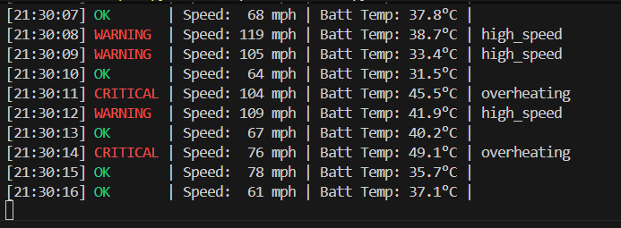
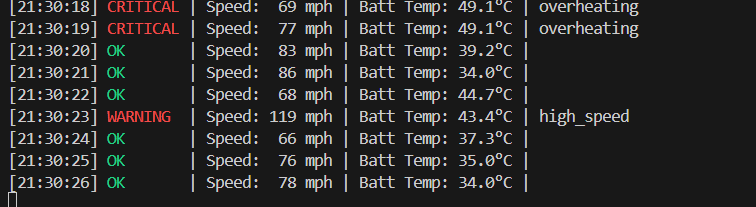

This project is a production-grade **Vehicle Diagnostics & Fault Detection Platform** aimed at processing high-frequency telemetry from connected vehicles. Similar to systems used by Tesla's Service/Engineering teams, it ingests real-time sensor data, applies logic to detect anomalies (e.g., Battery Overheating), and automatically recommends corrective actions. It uses **PostgreSQL** (or SQLite for local dev) to maintain a complete history of the vehicle's health state.

### Monitored Statistics
The system continuously discriminates and analyzes the following key metrics:
- **Vehicle Speed (mph)**: Monitoring for unsafe high-speed events.
- **Battery Temperature (°C)**: Critical monitoring for thermal runaway or overheating risks (>45°C triggers immediate faults).
- **High Voltage (V)**: Analyzing voltage stability and battery health.

A production-grade Vehicle Diagnostics & Fault Detection Platform built with Python (FastAPI) and PostgreSQL.

## Features
- **High-Performance Ingestion**: Asynchronous telemetry ingestion.
- **Diagnostics Engine**: Rule-based and anomaly detection for fault identification.
- **Root Cause Analysis**: Automated recommendations based on fault signatures.
- **RESTful API**: Clean API design for integration.

## Tech Stack
- **Framework**: FastAPI
- **Database**: PostgreSQL (Async via SQLAlchemy + AsyncPG)
- **Validation**: Pydantic v2
- **Data Processing**: Pandas / NumPy

## Setup
1. Create a virtual environment:
   ```bash
   python -m venv venv
   source venv/bin/activate  # On Windows: venv\Scripts\activate
   ```
2. Install dependencies:
   ```bash
   pip install -r requirements.txt
   ```
3. Run the server:
   ```bash
   uvicorn app.main:app --reload
   ```

## Simulator Demo
Below is the real-time telemetry simulator in action. It generates vehicle data, detects faults (like battery overheating), and logs them to the database.


*Figure 1: Real-time telemetry stream showing valid data (Green) and warnings (Red).*


*Figure 2: System detecting a Critical Battery Overheat fault.*

## Manual Diagnostics (SQL)
Since the system logs everything to the database, you can act like a Data Engineer and query the `tesla.db` directly to investigate incidents.

**1. Find all Critical Faults:**
```sql
SELECT code, description, detected_at 
FROM faults 
WHERE severity = 'CRITICAL' 
ORDER BY detected_at DESC;
```

**2. Analyze Telemetry leading up to a fault:**
```sql
-- Check the last 10 seconds of data for a specific vehicle
SELECT timestamp, data 
FROM telemetry_logs 
ORDER BY timestamp DESC 
LIMIT 10;
```

**3. Check Vehicle Health:**
```sql
SELECT vin, model, firmware_version 
FROM vehicles;
```